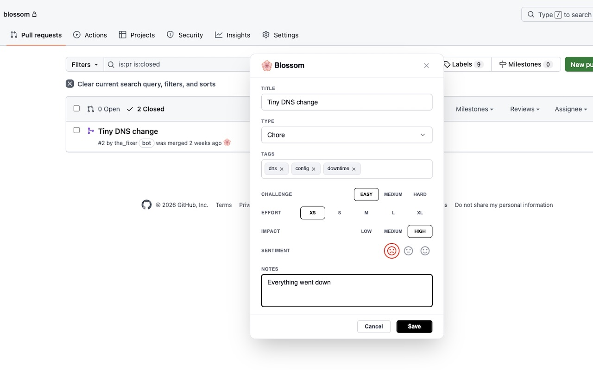

<div align="center">
  

  # Blossom

  **Turn GitHub Pull Requests into a personal work journal. Track tasks, see your stats, and reflect.**

  [Chrome Web Store](https://chromewebstore.google.com/detail/fncgholebmpcappmmmfnpcbfandhjplj) • [Website](https://github.com/paitonic/blossom)
</div>

---

<div align="center">
  
</div>

> This project is an independent open-source extension and is not affiliated with, endorsed by, or approved by GitHub, Inc. GitHub is a trademark of GitHub, Inc.

## Why
I want to understand the categories of tasks I work on, identify which tasks were challenging, see their impact in hindsight, and track how I felt doing them.

## How it works
Blossom injects a button directly into the GitHub Pull Request page. Clicking it opens a form with the following fields:
* **Tags:** Categorize tasks by skills learned, code areas touched, etc.
* **Challenge:** Technical difficulty.
* **Effort:** Time spent on this task, measured in t-shirt sizes.
* **Impact:** Measure the impact (e.g., unnoticed maintenance or deal-closing features).
* **Sentiment:** Record your overall sentiment — positive, neutral, or negative.
* **Notes:** Free-text field for context or reminders.

Clicking the extension icon in the browser toolbar will open the dashboard where you can see your rated PRs and metrics.

## Data
Your data is stored in your browser and it's **cleared** when the extension is removed. There is no sync functionality. No servers.
You can back up to JSON in the Settings tab on your dashboard. See [data format documentation](docs/data-format.md) for details.

## Permissions
| Permission | Type | Description |
| :--- | :--- | :--- |
| `storage` | Required | Saves your data [locally](https://developer.chrome.com/docs/extensions/reference/api/storage#local) in your browser |
| `downloads` | Optional | Used for importing and exporting your data as a JSON file. |

## Technology Stack
* **Core:** Svelte 5
* **Build Tooling:** Vite, CRXJS
* **Target:** Chromium-based browsers (Chrome, Edge, Brave, etc.)

## Project structure
```text
├── manifest.config.ts    # Extension manifest configuration
├── src/
│   ├── background/       # Service worker (responsible for opening the dashboard)
│   ├── content/          # Content scripts (GitHub DOM injection)
│   │   └── views/        # Extension injection logic, button and popover
│   ├── dashboard/        # Dashboard
│   └── shared/           # Shared code
```

## Contributing
Please see [CONTRIBUTING.md](CONTRIBUTING.md)

## Development Guide
### Setup
1. Install dependencies
```bash
npm install
```

2. Start the development server (HMR enabled):
```bash
npm run dev
```

3. Load the extension in your browser:
- Open chrome://extensions.
- Enable Developer mode (toggle in the top right).
- Click Load unpacked.
- Select the dist folder created by the build process.
- Run the development server


### Build
```bash
npm run build
```
Run one time build (`import.meta.env.DEV = true`)

### Release
```bash
npm run release
```
This will generate the final assets in the dist folder and also a zipped build in `release/` directory (`import.meta.env.PROD = true`).
